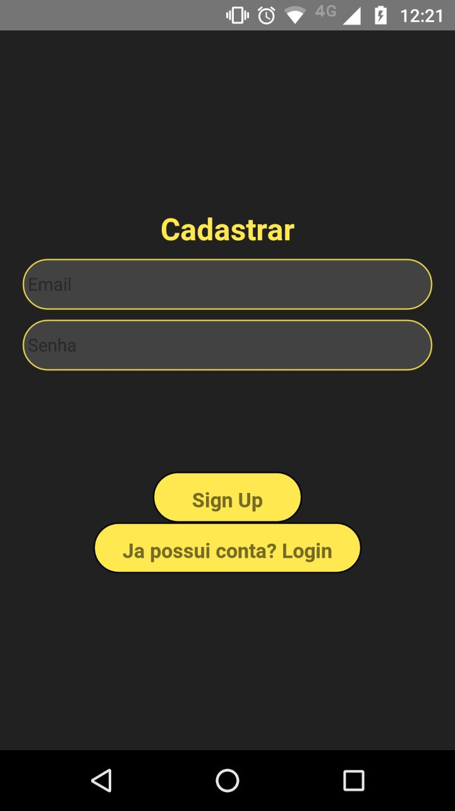

# starwarsapp

Um simples app feito em [React Native](https://facebook.github.io/react-native/) para consumir a api [SWAPI](https://swapi.co/)
## Libs utilizadas
  - [Firebase](https://rnfirebase.io/) -> para autenticação
  - [React Navegation](https://reactnavigation.org/) -> para fazer a navegação 
  - [React native elements](https://react-native-training.github.io/react-native-elements/) -> para os UIs
  - [Axios](https://github.com/axios/axios) -> Para consumir a api
  
## Como executar o app

  - Instalar o [react native](https://facebook.github.io/react-native/docs/getting-started)
  - Clonar o Repositório
  - Instalar as Dependência
  - Criar um projeto no [firebase](https://firebase.google.com/?hl=pt-br) e adicionar um app android/IOS
  - Dentro do repositório executar, react-native run-android ou run-ios

## ScreenShots
<li>
  <li>
  
  
  
  
  
  
  </li>
</li>
